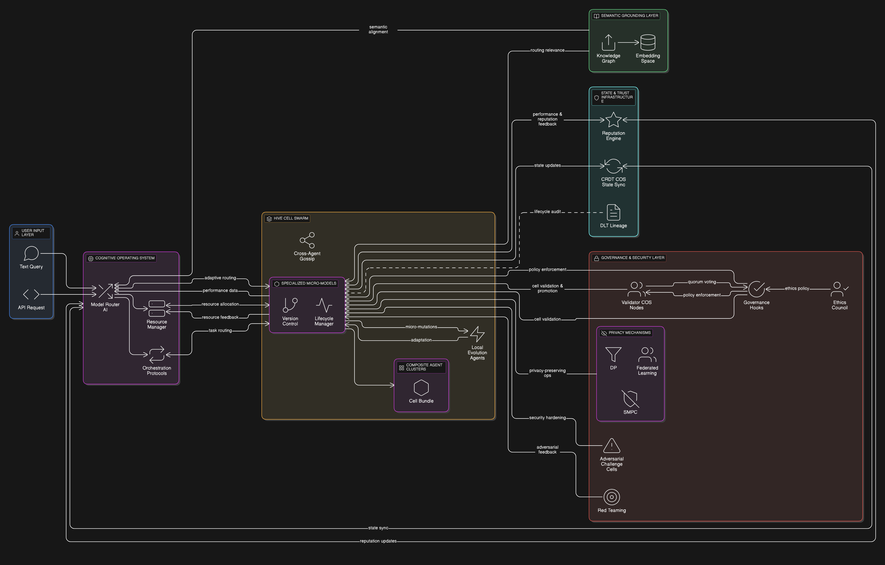

# HiveCell: A Cognitive Mesh Architecture (WIP)

> “What if intelligence wasn’t a single massive brain, but a buzzing swarm of specialist minds?”

HiveCell is a conceptual exploration into distributed, modular AI systems. It proposes an alternative to monolithic LLMs by imagining a mesh of small, specialised models or "Hive Cells" coordinated by a decentralised control layer called the Cognitive Operating System (COS).

This repo is a work-in-progress. It’s not a product or framework, just a space to play with AI, think out loud, sketch ideas, and maybe prototype a few components over time.

---

## 🧠 Core Concepts

### Hive Cells
- Containerised micro-models or agents
- Each focused on a single task (e.g. summarisation, translation, code generation)
- Communicate via standard APIs (REST/gRPC)
- Independently versioned, scaled, and retired

### Cognitive Operating System (COS)
- Routes tasks to the most appropriate Hive Cells
- Manages compute resources and orchestration
- Coordinates multistep workflows across the mesh

### CognitionHub
- A decentralised registry of Hive Cells
- Stores metadata and manifests (not binaries)
- Supports discovery, trust, and governance

---

## 🔍 Why This?

Monolithic LLMs are powerful but inflexible. HiveCell explores how we might:
- Reduce retraining overhead through modularity
- Improve efficiency by scaling only what’s needed
- Encourage open contribution and decentralised evolution
- Build trust through transparent governance and reputation

---

## 📄 Current Contents

| File                                                                                                                             | Description                                |
|----------------------------------------------------------------------------------------------------------------------------------|--------------------------------------------|
| [`docs/Self-Evolving Cognitive Mesh V0.3.pdf`](docs/Self-Evolving%20Cognitive%20Mesh%20V0.3.pdf)                                 | Concept essay outlining the architecture   |
| [`docs/Enhancing the Self-Evolving Cognitive Mesh V0.1.pdf`](docs/Enhancing%20the%20Self-Evolving%20Cognitive%20Mesh%20V0.1.pdf) | AI generated report                        |
| [`audio/Decoding the Self-Evolving Cognitive Mesh.mp3`](audio/Decoding%20the%20Self-Evolving%20Cognitive%20Mesh.mp3)             | AI generated audio discussion              |
| `specs/hivecell-manifest.schema.json`                                                                                            | Draft schema for Hive Cell metadata        |
| `notes/`                                                                                                                         | Design sketches, diagrams, and notes (WIP) |
| [`Cognitive-Mesh.html`](http://www.hivecell.4loop.co.uk/)                                                                                                        | Site                                       |
---

## 🏗️ System Diagram

## 🚧 Status

This is an exploratory learning project, primarily used to explore AI-assisted brainstorming. No working code yet just ideas, drafts, and potential starting points.

The initial idea was fleshed out in a number of sessions using multiple LLMs. For this particular exercise, the actual subject matter was of less importance than the brainstorming process itself, though it clearly resonated with the LLMs! The resulting `Self-Evolving Cognitive Mesh V0.3.pdf` is roughly a 50/50 split of human and AI content, with the accompanying research report, audio, and website being 100% AI-generated.

What I've taken away from this side quest is that by requesting continuous critique, you can really focus on the fun parts of exploring ideas, leading to an architecturally plausible real-world solution. So while these artifacts are part of this repo's journey, remember the core vision here is still HiveCell – that concept of a community-owned, distributed micro-model architecture.

If you just want a quick overview, checkout the `Decoding the Self-Evolving Cognitive Mesh.mp3`

If you’re curious or want to bounce thoughts, feel free to open an issue or drop me a message.

---

## 📜 License - MIT

